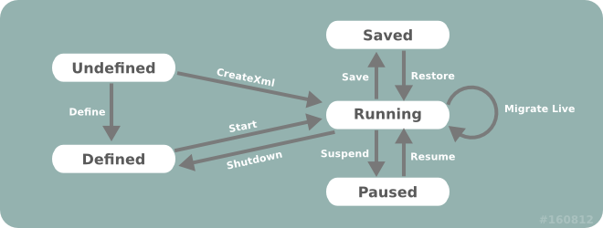

## Lifecycle Control

Libvirt can control the entire lifecycle of guest domains. Guest domains can transition through several states throughout their lifecycle:

1. **Undefined**. This is the baseline state. An undefined guest domain has not been defined or created in any way.
2. **Defined**. A defined guest domain has been defined but is not running. This state could also be described as Stopped.
3. **Running**. A running guest domain is defined and being executed on a hypervisor.
4. **Paused**. A paused guest domain is in a suspended state from the **Running** state. Its memory image has been temporarily stored, and it can be resumed to the Running state without the guest domain operating system being aware it was ever suspended.
5. **Saved**. A saved domain has had its memory image, as captured in the Paused state, saved to persistent storage. It can be restored to the **Running** state without the guest domain operating system being aware it was ever suspended.

<center>

</center>

### Provisioning and Starting
Provisioning refers to the task of creating new guest domains, typically using some form of operating system installation media. There are a wide variety of ways in which a guest can be provisioned, but the choices available will vary according to the hypervisor and type of guest domain being provisioned. It is not uncommon for an application to support several different provisioning methods. Starting refers to executing a provisioned guest domain on a hypervisor.

#### Methods For Provisioning

There are up to three methods involved in provisioning guests. The **createXML** method will create and immediately boot a new transient guest domain. When this guest domain shuts down, all trace of it will disappear. The **defineXML** method will store the configuration for a persistent guest domain. The **create** method will boot a previously defined guest domain from its persistent configuration. One important thing to note, is that the **defineXML** command can be used to turn a previously booted transient guest domain, into a persistent domain. This can be useful for some provisioning scenarios that will be illustrated later.

#### Booting a Transient Guest Domain

 To boot a transient guest domain, simply requires a connection to libvirt and a string containing the XML document describing the required guest configuration and a flag that controls the startup of the domain.
If the `VIR_DOMAIN_START_PAUSED` flag is set, the guest domain will be started, but its CPUs will remain paused. The CPUs can later be manually started using the **resume** method.

If the `VIR_DOMAIN_START_AUTODESTROY` flag is set, the guest domain will be automatically destroyed when the **virConnect** object is finally released. This will also happen if the client application crashes or loses its connection to the libvirtd daemon. Any domains marked for auto destroy will block attempts at migration, save-to-file, or snapshots.

```python
import sys
import libvirt

xmlconfig = "<domain>...</domain>"

conn = libvirt.open("qemu:///system")
if not conn:
    print("Failed to open connection to qemu:///system", file=sys.stderr)
    exit(1)

dom = conn.createXML(xmlconfig, 0)
if not dom:
    print("Failed to create a domain from an XML definition.", file=sys.stderr)
    exit(1)

print("Guest " + dom.name() + " has booted", file=sys.stderr)

conn.close()
```

If the domain creation attempt succeeded, then the returned **virDomain** instance will be returned, otherwise **None** will be returned. Although the domain was booted successfully, this does not guarantee that the domain is still running. It is entirely possible for the guest domain to crash, in which case attempts to use the returned **virDomain** object will generate an error, since transient guests cease to exist when they shutdown (whether a planned shutdown, or a crash). To cope with this scenario requires use of a persistent guest.

#### Defining and Booting a Persistent Guest Domain

Before a persistent domain can be booted, it must have its configuration defined. This again requires a connection to libvirt and a string containing the XML document describing the required guest configuration. The **virDomain** object obtained from defining the guest, can then be used to boot it.

Currently the **defineDomain** method defines a flags parameter that is unused. A value of **0** should always be supplied for that parameter. This may be changed in later versions of the method.

```python
import sys
import libvirt

xmlconfig = "<domain>...</domain>"

conn = libvirt.open("qemu:///system")
if not conn:
    print("Failed to open connection to qemu:///system", file=sys.stderr)
    exit(1)

dom = conn.defineXML(xmlconfig, 0)
if not dom:
    print("Failed to define a domain from an XML definition.", file=sys.stderr)
    exit(1)

if dom.create(dom) < 0:
    print("Can not boot guest domain.", file=sys.stderr)
    exit(1)

print("Guest " + dom.name() + " has booted", file=sys.stderr)

conn.close()
```

#### New Guest Domain Provisioning Techniques

This section will first illustrate two configurations that allow for a provisioning approach that is comparable to those used for physical machines. It then outlines a third option which is specific to virtualized hardware, but has some interesting benefits. For the purposes of illustration, the examples that follow will use an XML configuration that sets up a KVM fully virtualized guest, with a single disk and network interface and a video card using VNC for display.

```xml
<domain type="kvm">
  <name>demo</name>
  <uuid>c7a5fdbd-cdaf-9455-926a-d65c16db1809</uuid>
  <memory>500000</memory>
  <vcpu>1</vcpu>

  .... the <os> block will vary per approach ...

  <clock offset="utc"/>
  <on_poweroff>destroy</on_poweroff>
  <on_reboot>restart</on_reboot>
  <on_crash>destroy</on_crash>
  <devices>
    <emulator>/usr/bin/qemu-kvm</emulator>
    <disk type="file" device="disk">
      <source file="/var/lib/libvirt/images/demo.img"/>
      <driver name="qemu" type="raw"/>
      <target dev="hda"/>
    </disk>
    <interface type="bridge">
      <mac address="52:54:00:d8:65:c9"/>
      <source bridge="br0"/>
    </interface>
    <input type="mouse" bus="ps2"/>
    <graphics type="vnc" port="-1" listen="127.0.0.1"/>
  </devices>
</domain>
```

!!! warning "Important"
    Be careful in the choice of initial memory allocation, since too low a value may cause mysterious crashes and installation failures. Some operating systems need as much as 600 MB of memory for initial installation, though this can often be reduced post-install.


#### CD-ROM/ISO image provisioning

All full virtualization technologies have support for emulating a CD-ROM device in a guest domain, making this an obvious choice for provisioning new guest domains. It is, however, fairly rare to find a hypervisor which provides CD-ROM devices for paravirtualized guests.

The first obvious change required to the XML configuration to support CD-ROM installation, is to add a CD-ROM device. A guest domains' CD-ROM device can be pointed to either a host CD-ROM device, or to a ISO image file. The next change is to determine what the BIOS boot order should be, with there being two possible options. If the hard disk is listed ahead of the CD-ROM device, then the CD-ROM media won't be booted unless the first boot sector on the hard disk is blank. If the CD-ROM device is listed ahead of the hard disk, then it will be necessary to alter the guest config after install to make it boot off the installed disk. While both can be made to work, the first option is easiest to implement.

The guest configuration shown earlier would have the following XML chunk inserted:

```xml
<os>
  <type arch="x86_64" machine="pc">hvm</type>
  <boot dev="hd"/>
  <boot dev="cdrom"/>
</os>
```

NB, this assumes the hard disk boot sector is blank initially, so that the first boot attempt falls through to the CD-ROM drive. It will also need a CD-ROM drive device added.

```xml
<disk type="file" device="cdrom">
  <source file="/var/lib/libvirt/images/rhel5-x86_64-dvd.iso"/>
  <target dev="hdc" bus="ide"/>
</disk>
```

With the configuration determined, it is now possible to provision the guest. This is an easy process, simply requiring a persistent guest to be defined, and then booted.

```python
import sys
import libvirt

xmlconfig = "<domain>...</domain>"

conn = libvirt.open("qemu:///system")
if not conn:
    print("Failed to open connection to qemu:///system", file=sys.stderr)
    exit(1)

dom = conn.defineXML(xmlconfig, 0)
if not dom:
    print("Failed to define a domain from an XML definition.", file=sys.stderr)
    exit(1)

if dom.create(dom) < 0:
    print("Can not boot guest domain.", file=sys.stderr)
    exit(1)

print("Guest " + dom.name() + " has booted", file=sys.stderr)

conn.close()
```

If it was not possible to guarantee that the boot sector of the hard disk is blank, then provisioning would have been a two step process. First a transient guest would have been booted using CD-ROM drive as the primary boot device. Once that completed, then a persistent configuration for the guest would be defined to boot off the hard disk.

In addition to the **defineXML** method, the alternative method **defineXMLFlags** is available.

#### PXE Boot Provisioning

Some newer full virtualization technologies provide a BIOS that is able to use the PXE boot protocol to boot off the network. If an environment already has a PXE boot provisioning server deployed, this is a desirable method to use for guest domains.

PXE booting a guest obviously requires that the guest has a network device configured. The LAN that this network card is attached to, also needs a PXE / TFTP server available. The next change is to determine what the BIOS boot order should be, with there being two possible options. If the hard disk is listed ahead of the network device, then the network card won't PXE boot unless the first boot sector on the hard disk is blank. If the network device is listed ahead of the hard disk, then it will be necessary to alter the guest config after install to make it boot off the installed disk. While both can be made to work, the first option is easiest to implement.

The guest configuration shown earlier would have the following XML chunk inserted:

```xml
<os>
  <type arch="x86_64" machine="pc">hvm</type>
  <boot dev="hd"/>
  <boot dev="network"/>
</os>
```

NB, this assumes the hard disk boot sector is blank initially, so that the first boot attempt falls through to the NIC. With the configuration determined, it is now possible to provision the guest. This is an easy process, simply requiring a persistent guest to be defined, and then booted.

```python
import sys
import libvirt

xmlconfig = "<domain>...</domain>"

conn = libvirt.open("qemu:///system")
if not conn:
    print("Failed to open connection to qemu:///system", file=sys.stderr)
    exit(1)

dom = conn.defineXML(xmlconfig, 0)
if not dom:
    print("Failed to define a domain from an XML definition.", file=sys.stderr)
    exit(1)

if dom.create(dom) < 0:
    print("Can not boot guest domain.", file=sys.stderr)
    exit(1)

print("Guest " + dom.name() + " has booted", file=sys.stderr)

conn.close()
```

If it was not possible to guarantee that the boot sector of the hard disk is blank, then provisioning would have been a two step process. First a transient guest would have been booted using network as the primary boot device. Once that completed, then a persistent configuration for the guest would be defined to boot off the hard disk.

#### Direct Kernel Boot Provisioning

Paravirtualization technologies emulate a fairly restrictive set of hardware, often making it impossible to use the provisioning options just outlined. For such scenarios it is often possible to boot a new guest domain directly from an kernel and initrd image stored on the host file system. This has one interesting advantage, which is that it is possible to directly set kernel command line boot arguments, making it very easy to do fully automated installation. This advantage can be compelling enough that this technique is used even for fully virtualized guest domains with CD-ROM drive/PXE support.

The one complication with direct kernel booting is that provisioning becomes a two step process. For the first step, it is necessary to configure the guest XML configuration to point to a kernel/initrd.

```xml
<os>
  <type arch="x86_64" machine="pc">hvm</type>
  <kernel>/var/lib/libvirt/boot/f11-x86_64-vmlinuz</kernel>
  <initrd>/var/lib/libvirt/boot/f11-x86_64-initrd.img</initrd>
  <cmdline>method=http://download.fedoraproject.org/pub/fedora/linux/releases/32/Server/x86_64/os/ console=ttyS0 console=tty</cmdline>
</os>
```

Notice how the kernel command line provides the URL of download site containing the distro install tree matching the kernel/initrd. This allows the installer to automatically download all its resources without prompting the user for install URL. It could also be used to provide a kickstart file for completely unattended installation. Finally, this command line also tells the kernel to activate both the first serial port and the VGA card as consoles, with the latter being the default. Having kernel messages duplicated on the serial port in this manner can be a useful debugging avenue. Of course valid command line arguments vary according to the particular kernel being booted. Consult the kernel vendor/distributor's documentation for valid options.

The last XML configuration detail before starting the guest, is to change the `on_reboot` element action to be `destroy`. This ensures that when the guest installer finishes and requests a reboot, the guest is instead powered off. This allows the management application to change the configuration to make it boot off, just installed, the hard disk again. The provisioning process can be started now by creating a transient guest with the first XML configuration

```python
import sys
import libvirt

xmlconfig = "<domain>...</domain>"

conn = libvirt.open("qemu:///system")
if not conn:
    print("Failed to open connection to qemu:///system", file=sys.stderr)
    exit(1)

dom = conn.createXML(xmlconfig, 0)
if not dom:
    print("Unable to boot transient guest configuration.", file=sys.stderr)
    exit(1)

print("Guest "+dom.name()+" has booted", file=sys.stderr)

conn.close()
```

Once this guest shuts down, the second phase of the provisioning process can be started. For this phase, the "OS" element will have the `kernel/initrd/cmdline` elements removed, and replaced by either a reference to a host side bootloader, or a BIOS boot setup. The former is used for Xen paravirtualized guests, while the latter is used for fully virtualized guests.

The phase 2 configuration for a Xen paravirtualized guest would thus look like:

```xml
<bootloader>/usr/bin/pygrub</bootloader>
<os>
  <type arch="x86_64" machine="pc">xen</type>
</os>
```

while a fully-virtualized guest would use:
```xml
<bootloader>/usr/bin/pygrub</bootloader>
<os>
  <type arch="x86_64" machine="pc">hvm</type>
  <boot dev="hd"/>
</os>
```

With the second phase configuration determined, the guest can be recreated, this time using a persistent configuration

```python
import sys
import libvirt

xmlconfig = "<domain>...</domain>"

conn = libvirt.open("qemu:///system")
if not conn:
    print("Failed to open connection to qemu:///system", file=sys.stderr)
    exit(1)

dom = conn.createXML(xmlconfig, 0)
if not dom:
    print("Unable to define persistent guest configuration.", file=sys.stderr)
    exit(1)

if dom.create(dom) < 0:
    print("Can not boot guest domain.", file=sys.stderr)
    exit(1)

print("Guest " + dom.name() + " has booted", file=sys.stderr)

conn.close()
```


In addition to the **createXML** method, the alternative method **createXMLFlags** is available.

### Stopping

Stopping refers to the process of halting a running guest. A guest can be stopped by two methods: shutdown and destroy.

The **shutdown** method is a clean stop process, which sends a signal to the guest domain operating system asking it to shut down immediately. The guest will only be stopped once the operating system has successfully shut down. The shutdown process is analogous to running a shutdown command on a physical machine. There is also a **shutdownFlags** method which can, depending on what the guest OS supports, can shutdown the domain and leave the object in a usable state.

The **destroy** and the **destroyFlags** method immediately terminate the guest domain. The destroy process is analogous to pulling the plug on a physical machine.

### Suspend / Resume and Save / Restore

the suspend and resume methods refer to the process of taking a running guest and temporarily saving its memory state. At a later time, it is possible to resume the guest to its original running state, continuingly execution where it left off. Suspend does not save a persistent image of the guest's memory. For this, save is used.

The save and restore methods refer to the process of taking a running guest and saving its memory state to a file. At some time later, it is possible to restore the guest to its original running state, continuing execution where it left off.

It is important to note that the save/restore methods only save the memory state, no storage state is preserved. Thus when the guest is restored, the underlying guest storage must be in exactly the same state as it was when the guest was initially saved. For basic usage this implies that a guest can only be restored once from any given saved state image. To allow a guest to be restored from the same saved state multiple times, the application must also have taken a snapshot of the guest storage at time of saving, and explicitly revert to this storage snapshot when restoring. A future enhancement in libvirt will allow for an automated snapshot capability which saves memory and storage state in one operation.

The save operation requires the fully qualified path to a file in which the guest memory state will be saved. This filename is in the hypervisor's file system, not the libvirt client application's. There's no difference between the two if managing a local hypervisor, but it is critically important if connecting remotely to a hypervisor across the network. The example that follows demonstrates saving a guest called "demo-guest" to a file. It checks to verify that the guest is running before saving, though this is technically redundant since the hypervisor driver will do such a check itself.

```python
import sys
import libvirt

filename = "/var/lib/libvirt/save/demo-guest.img"

conn = libvirt.open("qemu:///system")
if not conn:
    print("Failed to open connection to qemu:///system", file=sys.stderr)
    exit(1)

dom = conn.lookupByName("demo-guest")
if not dom:
    print("Cannot find guest to be saved.", file=sys.stderr)
    exit(1)

info = dom.info()
if not info:
    print("Cannot check guest state", file=sys.stderr)
    exit(1)

if info.state == VIR_DOMAIN_SHUTOFF:
    print("Not saving guest that is not running", file=sys.stderr)
    exit(1)

if dom.save(filename) < 0:
    print("Unable to save guest to " + filename, file=sys.stderr)

print("Guest state saved to " + filename, file=sys.stderr)

conn.close()
```

Some period of time later, the saved state file can then be used to restart the guest where it left of, using the virDomainRestore method. The hypervisor driver will return an error if the guest is already running, however, it won't prevent attempts to restore from the same state file multiple times. As noted earlier, it is the applications' responsibility to ensure the guest storage is in exactly the same state as it was when the save image was created.

In addition, the saveFlags methods allows the domain to be save and at the same alter the configuration of the saved image. When the domain is restored the new configuration will be applied to the running domain.

There is also another way to save a domain. The managedSave method can also save a running domain state, only in this case The system selects the location for the saved image. In addition, the domain will be restored to the save state when the domain is restarted.

```python
import sys
import libvirt

filename = "/var/lib/libvirt/save/demo-guest.img"

conn = libvirt.open("qemu:///system")
if not conn:
    print("Failed to open connection to qemu:///system", file=sys.stderr)
    exit(1)

domID = conn.restore(filename))
if domID < 0:
    print("Unable to restore guest from " + filename, file=sys.stderr)
    exit(1)

dom = conn.lookupByID(domID)
if not dom:
    print("Cannot find guest that was restored", file=sys.stderr)
    exit(1)

print("Guest state restored from " + filename, file=sys.stderr)

conn.close()
```

!!! note "Note:"
    Restoring a guest domain does not update the domain's current date/time. When a guest domain is restored it is returned to the state when it was saved. This will include the date and time when the domain was saved. The guest domain usually will not be able to determine that a time period has passed since it was saved. This means the current time will not be automatically updated either during or after the restore operation.

In addition to the **restore** method, the alternative method **restoreFlags** is available.

### Migration

Migration is the process of taking the image of a guest domain and moving it somewhere, typically from a hypervisor on one node to a hypervisor on another node. There are two methods for migration.

```python
migrate(self, dconn, flags=0, dname=None, uri=None, bandwidth=0)
```

The **migrate** method takes an established hypervisor connection, and instructs the domain to migrate to this connection.

```python
migrateToURI(self, duri, flags=0, dname=None, bandwidth=0)
```

The **migrateToUri** method takes a URI specifying a hypervisor connection, opens the connection, then instructions the domain to migrate to this connection. Both these methods can be passed a parameter to specify live migration. For migration to complete successfully, storage needs to be shared between the source and target hypervisors.

The first parameter of the **migrate** method specifies the connection to be used to the target of the migration. This parameter is required.

The second parameter of the **migrate** method specifies a set of flags that control how the migration takes place over the connection. If no flags are needed then the parameter should be set to zero.

Flags may be one of more of the following:

```python
VIR_MIGRATE_LIVE               = 1
VIR_MIGRATE_PEER2PEER          = 2
VIR_MIGRATE_TUNNELLED          = 4
VIR_MIGRATE_PERSIST_DEST       = 8
VIR_MIGRATE_UNDEFINE_SOURCE    = 16
VIR_MIGRATE_PAUSED             = 32
VIR_MIGRATE_NON_SHARED_DISK    = 64
VIR_MIGRATE_NON_SHARED_INC     = 128
VIR_MIGRATE_CHANGE_PROTECTION  = 256
VIR_MIGRATE_UNSAFE             = 512
VIR_MIGRATE_OFFLINE            = 1024
VIR_MIGRATE_COMPRESSED         = 2048
VIR_MIGRATE_ABORT_ON_ERROR     = 4096
VIR_MIGRATE_AUTO_CONVERGE      = 8192
VIR_MIGRATE_RDMA_PIN_ALL       = 16384
VIR_MIGRATE_POSTCOPY           = 32768
VIR_MIGRATE_TLS                = 65536
VIR_MIGRATE_PARALLEL           = 131072
```

The third parameter of the **migrate** method specifies a new name for the domain on the target of the migration. Not all hypervisors support this operation. If no rename of the domain is required then the parameter should be set to **None**.

The forth parameter of the **migrate** method specifies the URI to be used as the target of the migration. A URI is only required when the target system supports multiple hypervisors. If there is only a single hypervisor on the target system then the parameter can be set to **None**.

The fifth and last parameter of the **migrate** method specifies the bandwidth in MiB/s to be used. If this maximum is not needed then set the parameter to zero.

To migrate a guest domain to a connection that is already open use the **migrate** method. An example follows:

```python
import sys
import libvirt

domName = "Fedora32-x86_64-1"

conn = libvirt.open("qemu:///system")
if not conn:
    print("Failed to open connection to qemu:///system", file=sys.stderr)
    exit(1)

dst_conn = libvirt.open("qemu+ssh://dst/system")
if not conn:
    print("Failed to open connection to qemu+ssh://dst/system", file=sys.stderr)
    exit(1)

dom = conn.lookupByName(domName)
if not dom:
    print("Failed to find the domain " + domName, file=sys.stderr)
    exit(1)

flags = libvirt.VIR_MIGRATE_LIVE

new_dom = dom.migrate(dst_conn, flags=flags, dname=None, uri=None, bandwidth=0)
if not new_dom:
    print("Could not migrate to the new domain", file=sys.stderr)
    exit(1)

print("Domain was migrated successfully.", file=sys.stderr)

dst_conn.close()
conn.close()
```

The **migrateToURI** method is similar except that the destination URI is the first parameter instead of an existing connection. To migrate a guest domain to a URI use the **migrateToURI** method. An example follows:

```python
import sys
import libvirt

domName = "Fedora32-x86_64-1"

conn = libvirt.open("qemu:///system")
if not conn:
    print("Failed to open connection to qemu:///system", file=sys.stderr)
    exit(1)

dom = conn.lookupByName(domName)
if not dom:
    print("Failed to find the domain " + domName, file=sys.stderr)
    exit(1)

new_dom = dom.migrateToURI("qemu+ssh://dst/system", 0, None, 0)
if new_not dom:
    print("Could not migrate to the new domain", file=sys.stderr)
    exit(1)

print("Domain was migrated successfully.", file=sys.stderr)

conn.close()
```

To migrate a live guest domain to a URI use the migrate or the **migrateToURI** with the `VIR_MIGRATE_LIVE` flag set. An example follows:

```python
import sys
import libvirt

domID = 6

conn = libvirt.open("qemu:///system")
if not conn:
    print("Failed to open connection to qemu:///system", file=sys.stderr)
    exit(1)

dst_conn = libvirt.open("qemu+ssh://dst/system")
if not conn:
    print("Failed to open connection to qemu+ssh://dst/system", file=sys.stderr)
    exit(1)

dom = conn.lookupByID(domID)
if not dom:
    print("Failed to find domain ID " + str(domID), file=sys.stderr)
    exit(1)

new_dom = dom.migrate(dst_conn, libvirt.VIR_MIGRATE_LIVE, None, None, 0)
if new_not dom:
    print("Could not migrate to the new domain", file=sys.stderr)
    exit(1)

print("Domain was migrated successfully.", file=sys.stderr)

dst_conn.close()
conn.close()
```

In addition to the **migrate** method, there are the alternative methods **migrate2**, **migrate3**, **migrateToURI**, **migrateToURI2**, and **migrateToURI3** for migration over other types of connections.

### Autostart

A guest domain can be configured to autostart on a particular hypervisor, either by the hypervisor itself or libvirt. In combination with managed save, this allows the operating system on a guest domain to withstand host reboots without ever considering itself to have rebooted. When libvirt restarts, the guest domain will be automatically restored. This is handled by an API separate to regular save and restore, because paths must be known to libvirt without user input.

```python
import sys
import libvirt

domID = 6

conn = libvirt.open("qemu:///system")
if not conn:
    print("Failed to open connection to qemu:///system", file=sys.stderr)
    exit(1)

dom = conn.lookupByID(domID)
if not dom:
    print("Failed to find domain ID " + str(domID), file=sys.stderr)
    exit(1)

dom.setAutostart(1)  # enable autostart

conn.close()
```
